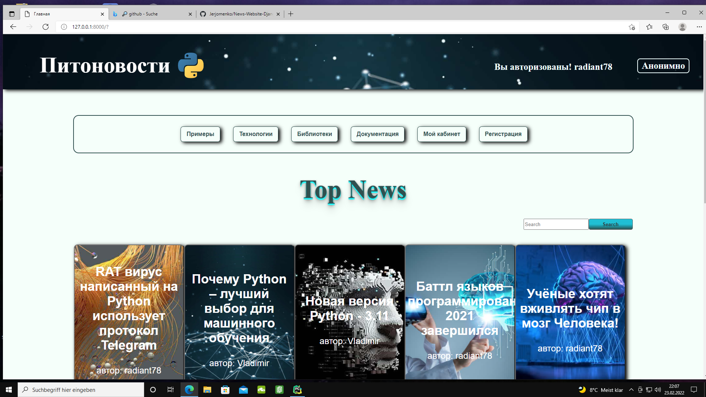

# __Arbeitslayout der News-Site.__
____

#### Arbeitslayout der News-Site.
News-Site mit Benutzerregistrierung, Authentifizierung, konfiguriertem Admin-Panel. Möglichkeit, Moderatorenrechte wie in Admin, wie in Template zu verteilen.
Erstellung von Nachrichten durch Benutzer mit Autorenrechten. Kommentare zu den Nachrichten von allen Benutzern.
Möglichkeit der Suche nach Nachrichten nach Tag, Paginierung. Außerdem gibt es einen Videoplayer.

____

## Verwendete Technologien:
+ __Python 3.8.7__
+ __Django 3.2.9__
+ __HTML5__
+ __CSS3__

